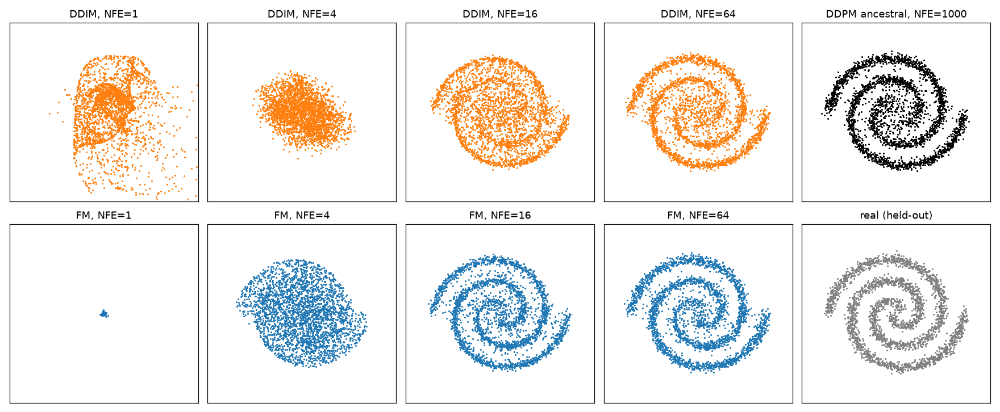
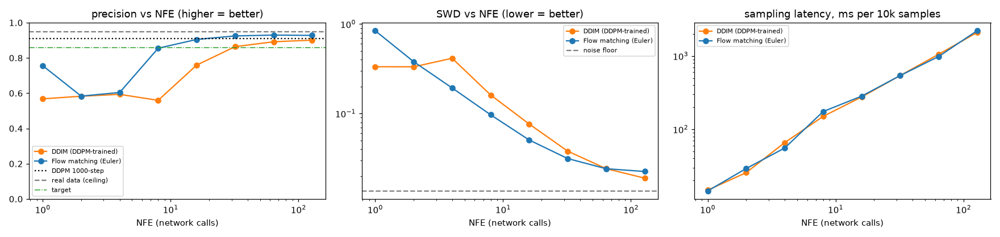
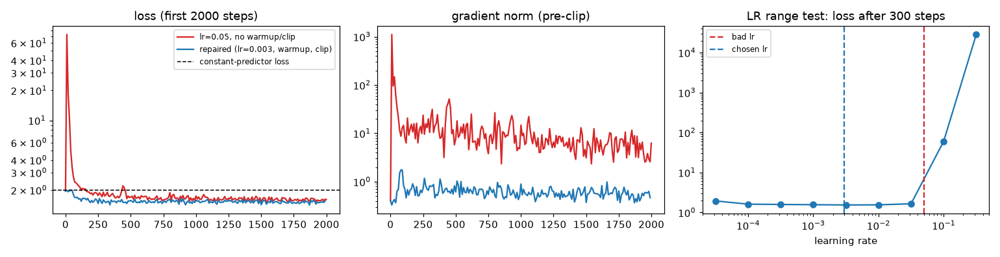
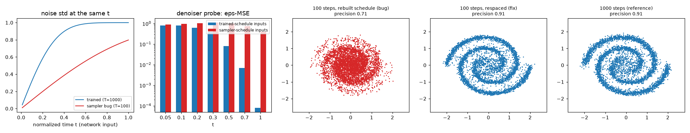
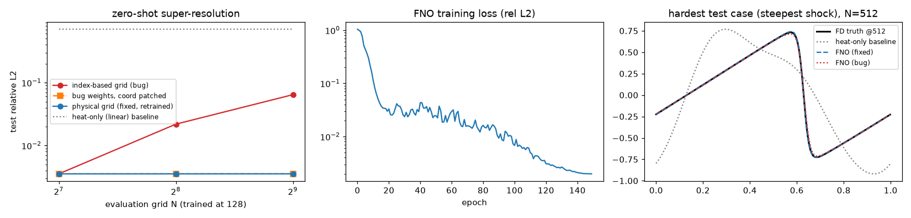
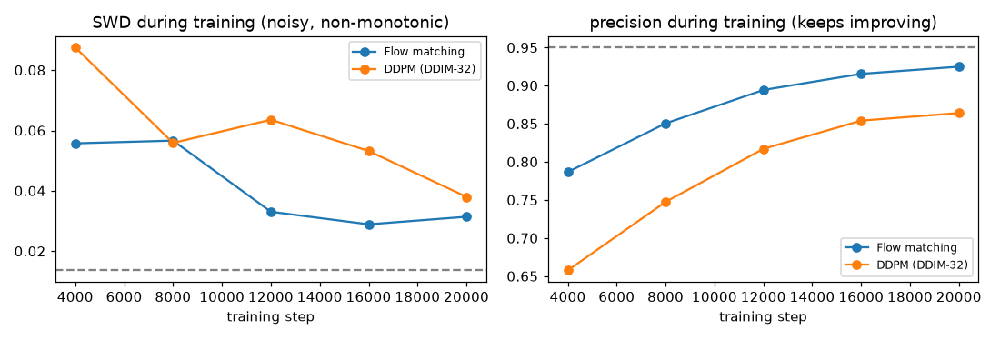

# Week-04_Three-Generative-Recipes-One-Colab-Session-Diffusion-Flow-Matching-and-a-Toy-Neural-Operator
Diffusion, Flow Matching, and a Toy Neural Operator

Halden Marine Systems scouting study: is a GPU pilot of modern generative and operator-learning methods worth funding? This repo answers with measurements from one free GPU. It contains three toy models on self-generated data, four training failures diagnosed and fixed, and a decision table for Kwame Boateng.

| Part | Model | Self-generated data |
|---|---|---|
| A | DDPM (ancestral + DDIM samplers) | NumPy two-spirals |
| B | Flow matching / rectified flow (Euler) | same spirals, same network, same recipe |
| C | 1D Fourier Neural Operator | own finite-difference viscous Burgers solver |

## Quick start

| Where | How |
|---|---|
| **Google Colab T4** (graded run) | *Runtime → Change runtime type → T4 GPU*, `git clone` this repo and `%cd` into it, then *Run all*. At the end it asks whether to write the VM-CPU vs T4 comparison into this README and push it with a fine-grained token. Full guide: [COLAB.md](COLAB.md) |
| **Windows** | `powershell -ExecutionPolicy Bypass -File .\Install-Assignment_04_Three_Generative_Recipes_Windows.ps1` |
| **macOS** | Double-click `Install-Assignment_04_Three_Generative_Recipes_macOS.command` (first time: right-click → Open, or `chmod +x` it) |

Both installers find Python 3.10+, create a project-local `.venv`, and run `env_setup.py`. That script detects the
imports in the assignment script, installs whatever is missing and reports the device. The installers then offer
a **quick smoke test** (~2–3 min, numbers not meaningful) or the **full run** (~10 min on a 16-core CPU).
Unattended: add `-Launch none|quick|full` on Windows, or set `LAUNCH=none|quick|full` on macOS.

### Environment detection (`env_setup.py`)

The notebook's first cell is `env_setup.py`, inlined by `scripts/build_notebook.py`, so the notebook runs on Colab
with nothing else uploaded. It:

- detects **Colab vs local**, and confirms a **Tesla T4** through both `nvidia-smi` and `torch.cuda` (name, VRAM, sm_75);
- installs **only missing** packages and never reinstalls Colab's CUDA torch;
- warns when Colab is on a **CPU runtime**, or when `nvidia-smi` sees a GPU that **torch can't use** (a CPU wheel installed over CUDA);
- tags every output `t4gpu` / `gpu` / `cpu` (`_quick` for smoke tests), so runs never overwrite each other;
- writes a hardware manifest (GPU, VRAM, driver, CPU, package versions, per-stage timings) next to the results.

`setup(require_t4=True)` makes it refuse to run anywhere but a T4.

<!-- RESULTS:BEGIN -->
<!-- Generated by scripts/update_readme.py from results/*.json; edits inside these markers are overwritten. -->
## Results: VM CPU vs Colab T4

> Only the VM CPU run is in `results/` so far. The Colab T4 column and the speedup column appear after the T4 run (see COLAB.md).

Same code, same seeds, same budgets on every machine. **Quality numbers should match across hardware** (small drift comes from GPU vs CPU floating-point order); **wall-clock and VRAM are what the hardware changes.** Speedup = CPU time ÷ GPU time.

### Hardware

| | VM · CPU only |
|---|---:|
| Device | CPU only: Intel64 Family 6 Model 183 Stepping 1, GenuineIntel, 16 cores |
| Platform / Python | windows / 3.14.7 |
| torch | `2.14.0+cpu` |
| **Total notebook runtime** | 662.4 s |

### Wall-clock and memory (lower is better)

| | VM · CPU only |
|---|---:|
| Flow-matching training (20k steps, incl. checkpoints) | 156.9 s |
| DDPM training (20k steps, incl. checkpoints) | 155.8 s |
| FNO training (150 epochs) | 115.1 s |
| Burgers data generation (1,200 solves) | 6.7 s |
| DDPM 1000-step sampling, 10k samples | 16.2 s |
| DDIM sampling at target NFE, 10k samples | 540.7 ms |
| Flow-matching sampling at target NFE, 10k samples | 283.3 ms |
| FD solver, 200 cases @512 | 366.8 ms |
| FNO inference, 200 cases @512 | 89.8 ms |
| Peak VRAM: flow-matching training | n/a |
| Peak VRAM: DDPM training | n/a |
| Peak VRAM: FNO training | n/a |

### Quality (should agree across hardware)

| | VM · CPU only |
|---|---:|
| Flow matching: best precision (real data 0.950) | 0.930 |
| DDIM: best precision | 0.901 |
| DDPM 1000-step: precision | 0.909 |
| DDPM 1000-step: recall | 0.942 |
| Network calls to target: flow matching | 16 |
| Network calls to target: DDIM | 32 |
| FNO rel-L2 @128 (training grid) | 0.0035 |
| FNO rel-L2 @512 (zero-shot) | 0.0035 |
| FNO with coordinate bug (F3) @512 | 0.0644 |
| Heat-only (linear physics) baseline | 0.7086 |

Target = precision and recall within 0.05 of the 1000-step DDPM. Failure-and-fix logs: [VM · CPU only](results/failure_log_cpu.md).





<details>
<summary>Failure figures F1–F4 (VM · CPU only)</summary>









</details>
<!-- RESULTS:END -->

## Repository layout

```text
Assignment_04_Three_Generative_Recipes_Colab.ipynb        Colab notebook (built from the script; env_setup inlined)
Install-Assignment_04_Three_Generative_Recipes_Windows.ps1
Install-Assignment_04_Three_Generative_Recipes_macOS.command
env_setup.py              environment detection, T4 checks, missing-package install, hardware snapshot
COLAB.md                  step-by-step T4 run and how to bring results back
requirements.txt          known-good versions (record only; not for Colab)
scripts/
  Assignment_04_Three_Generative_Recipes.py              full script: SCRIPT DETAILS region, Step 1–24 banners
                                                         with explanations and reference links (single source)
  Assignment_04_Three_Generative_Recipes_Simplified.py   same code, banners/explanations/references stripped
  build_notebook.py       regenerates the .ipynb and the _Simplified.py from the full script
results/                  <name>_<tag>.* outputs: failure_log, results, manifest, figs
docs/video_outline.md     speaker notes for the video walkthrough
```

The full script uses the same layout as the Week-02 scripts: a `SCRIPT DETAILS` region with APA references, then one
`# Step N: Title` banner per section, whose comment lines explain the step and whose docstring lists the docs and papers
it relies on. In the notebook, each banner becomes the markdown cell above its code.

Edit only the full script (and `env_setup.py`), then run `python scripts/build_notebook.py`. It regenerates both the
notebook and `_Simplified.py`, so don't edit those two by hand.
